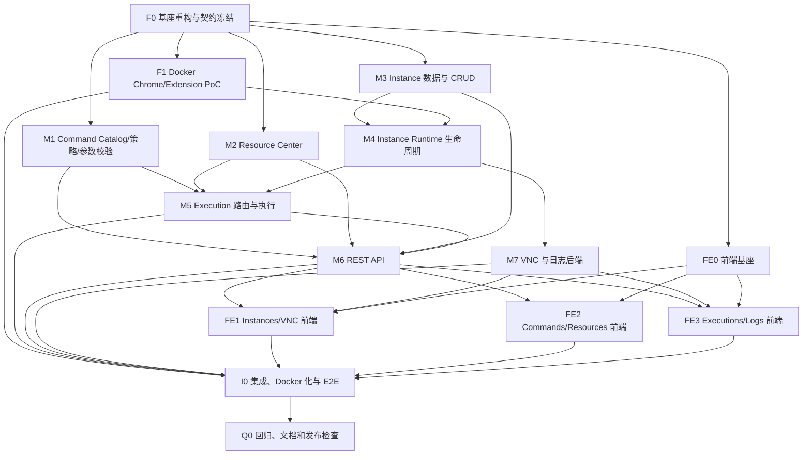

# opencli-hub 实施任务拆分

## 1. 目的

本文档将 `technical-design.md` 拆分为可单 Agent 开发、也可由多个 Agent 并行协作的大任务项。

任务拆分原则：

- 每个任务有明确的文件边界、输入、交付物和验收条件；
- 优先垂直闭环，避免只创建空接口或占位类；
- 并行任务尽量不修改同一文件；
- 共享契约先冻结，再并行开发；
- 每个任务完成时必须有测试或可重复验证命令；
- 不以“代码可编译”代替业务验收；
- 所有实现遵循 `docs/technical-design.md` 和 KISS 原则。

## 2. 总体依赖图



## 3. 并行开发建议

### 3.1 第一阶段

必须串行完成：

```text
F0 基座重构与契约冻结
```

F0 完成后才能稳定并行，否则多个 Agent 会同时修改根 POM、模块依赖、包名和 DTO。

### 3.2 第二阶段并行组

F0 完成后可并行：

```text
Agent A -> F1 Docker Chrome/Extension PoC
Agent B -> M1 Command 子系统
Agent C -> M2 Resource 子系统
Agent D -> M3 Instance 数据与 CRUD
Agent E -> FE0 前端基座
```

这些任务应避免交叉修改：

- F1：`Dockerfile`、Docker scripts 和 PoC 文档；
- M1：`core/command`，使用 F0 已冻结的 share command DTO；
- M2：`core/resource`，使用 F0 已冻结的 share resource DTO；
- M3：`core/instance` 的 model/repo/service，不实现进程 runtime；
- FE0：`frontend` 基座，不实现具体 feature 页面。

### 3.3 第三阶段

```text
M4 Instance Runtime
```

依赖 M3 和 F1 的已验证启动参数。

M4 完成后：

```text
M5 Execution
M7 VNC/Logs 后端中的日志部分
```

可以部分并行。

### 3.4 第四阶段

M1/M2/M3/M4/M5 完成后：

```text
M6 REST API
M7 VNC 完整后端
```

随后前端 feature 可分给三个 Agent：

```text
FE1 Instances + VNC
FE2 Commands + Resources
FE3 Executions + Logs
```

### 3.5 最终集成

I0 和 Q0 应由单一集成负责人完成，避免多个 Agent 同时修改 Docker、路由、应用配置和最终 E2E。

## 4. 任务交付规范

每个任务交付报告必须包含：

1. 修改文件列表；
2. 完成的行为；
3. 测试和验证命令；
4. 尚未覆盖的边界；
5. 与其他任务的接口变化；
6. 是否修改了设计文档。

Java 验证统一使用：

```bash
env JAVA_HOME=$JAVA_HOME_17 mvn clean test
```

禁止在任务中：

- 修改未归属当前任务的业务包；
- 擅自新增模块；
- 引入 Redis、MQ、Selenium、Playwright；
- 修改 OpenCLI 源码；
- 添加认证逻辑；
- 以 TODO 或空实现宣称完成。

---

# F0 基座重构与契约冻结

## 目标

将当前不可编译的四模块原型整理为可持续开发的 `share + core + web` 三模块基座，完成模块合并、SQL 初始化、核心 DTO/枚举/错误码和测试骨架。

## 依赖

无，是所有其他任务的前置任务。

## 主要工作

### 1. 移除 infra module

- 根 POM 删除 `opencli-hub-infra` dependencyManagement 和 module；
- `web/pom.xml` 删除 infra 依赖；
- infra 的 MyBatis、MySQL、H2、Auto Mapper 依赖移到 core；
- infra Java 类移动到 core 对应业务域；
- 删除手写 Mapper XML，由 Auto Mapper 在编译期生成到 `target/classes`；
- 删除 `InfraAutoConfiguration` 和 infra auto-configuration imports；
- `CoreAutoConfiguration` 增加 `@BaseMapperScan`。

### 2. 清理 Demo

删除：

- `DemoController`；
- `DemoServiceTest`；
- `TestDemoRepository`；
- `MysqlDemoRepositoryTest`；
- 仅为 Demo 服务的测试启动类或无效引用。

### 3. 建立包骨架

按设计文档创建：

```text
core/command
core/execution
core/instance
core/log
core/opencli
core/resource
```

只迁移已有有效代码，不创建大批空类。

### 4. 冻结 share 契约

完成以下 DTO 和枚举的最终包位置与字段：

- Instance create/update/detail/runtime；
- Execution request/detail/status；
- Command summary/arg/output rule/blacklist；
- Resource item/date summary；
- Log content/source；
- InstanceState、SiteSessionMode、ResourceSource 等。

同时冻结供并行任务依赖的最小 core 契约，包括 `OpenCliCommandCatalog` 查询接口和 Command Catalog 基础模型；F0 不实现 Catalog 加载，M1 负责实现。M3 只依赖该接口校验网站，不依赖 M1 的具体实现。

### 5. 错误码

根据设计文档补齐错误码，删除旧 `INSTANCE_OFFLINE/UNHEALTHY` 等不再使用的语义。

### 6. SQL

新增：

```text
core/src/main/resources/schema-h2.sql
core/src/main/resources/data-h2.sql
core/src/main/resources/schema-mysql.sql
core/src/main/resources/data-mysql.sql
```

包含四张表。移除 Repository/Mapper 运行时建表能力。

### 7. H2 profile

`application-local-h2.yml` 配置：

```text
MODE=MySQL
DATABASE_TO_LOWER=TRUE
spring.sql.init.mode=always
schema/data locations
```

### 8. 测试基座

- 一个可启动的 core H2 测试上下文；
- 一个 web context smoke test；
- 确认 Auto Mapper 能生成并加载 Mapper。

## 文件边界

主要允许修改：

```text
pom.xml
share/**
core/pom.xml
core/src/main/java/**（迁移和契约骨架）
core/src/main/resources/**
web/pom.xml
web/src/main/resources/**
infra/**（最终删除）
```

## 验收条件

```bash
env JAVA_HOME=$JAVA_HOME_17 mvn clean test
```

必须满足：

- 根模块只有 share/core/web；
- 不存在 Demo 编译引用；
- H2 测试上下文启动成功；
- 四张表通过 SQL 初始化；
- 不存在 `createTableIfNotExists`；
- 不存在 Repository `init()`；
- 不存在对 infra artifact/package 的引用。

## 复杂度

大；必须由单一 Agent 完成。

---

# F1 Docker 正式 Chrome + Extension PoC

## 目标

在 Docker 环境验证正式 Google Chrome、固定版本 OpenCLI extension、daemon、contextId 和 Xvfb/VNC 链路，为 M4 提供已验证参数。

## 依赖

F0 完成；业务功能不要求完成。

## 主要工作

### 1. Dockerfile 基础

- Debian/Ubuntu glibc 基础；
- Java 17 runtime；
- Node.js；
- 正式 google-chrome-stable；
- Xvfb/openbox/x11vnc/字体；
- tini；
- 指定版本 OpenCLI CLI；
- 指定版本 extension ZIP 解压到 `/opt/opencli/extension`；
- 非 root 用户。

### 2. PoC 脚本

创建临时 Profile 并启动：

```text
Xvfb -> openbox -> x11vnc -> Chrome
```

使用设计中的 extension 参数。

### 3. 验证

- `opencli daemon restart` 成功；
- extension 连接 daemon；
- `/status` 出现 contextId；
- Chrome 重启后 contextId 保持；
- 新 Profile 产生不同 contextId；
- VNC TCP 可连接；
- 不使用 Chromium/ChromeDriver/Playwright。

### 4. 输出 PoC 结论

记录：

- Chrome 实际版本；
- extension 版本；
- OpenCLI 版本；
- 必需启动参数；
- 必需系统包；
- `/dev/shm` 要求；
- 已知警告或限制。

## 文件边界

```text
Dockerfile
scripts/docker/**
docs/poc-chrome-extension.md（可新增）
```

不修改业务 Service。

## 验收条件

一条 Docker 命令能重复构建并运行 PoC，日志中能输出唯一 contextId，VNC 可用。

## 复杂度

大，环境验证型任务；适合独立 Agent。

---

# M1 Command Catalog、黑名单、输出规则与参数校验

## 目标

构建完整命令控制面：加载 OpenCLI Catalog、公开 website browser command、解析 alias、校验业务参数、拒绝保留参数、维护黑名单和输出规则。

## 依赖

F0。

## 主要工作

### 1. Catalog

基于 F0 冻结的 `OpenCliCommandCatalog` 和 Catalog 模型，实现：

```text
ProcessBuilderOpenCliCommandCatalog
Catalog JSON parser
canonical command index
alias index
website index
```

启动执行 `opencli list -f json`，解析所有需要字段，建立 canonical key 和 alias 索引。若确需改变 F0 契约，必须先由集成人协调。

### 2. 公开范围

只返回 `browser=true` 的 website command；内建管理命令不可见。

### 3. 参数 parser

实现 Catalog 驱动的：

- positional；
- named option；
- required/valueRequired；
- choices；
- int/float/bool/string；
- unknown/repeated option；
- `--name=value`；
- 规范化 argv。

### 4. 保留参数

拒绝设计文档中的 OpenCLI 控制参数。

### 5. 黑名单

实现 Domain/Repository/Mapper/Service 和缓存；支持查询、禁用和启用。

### 6. 输出规则

实现 Domain/Repository/Mapper/Service、缓存和 Catalog 兼容校验。

### 7. Resource path 扩展点

Validator 返回参数结构，M2 后续可以解析 resourcePath；M1 不直接访问文件系统。

## 文件边界

```text
core/src/main/java/fun/fengwk/openclihub/core/command/**
core/src/main/java/fun/fengwk/openclihub/core/opencli/catalog/**
core/src/test/java/fun/fengwk/openclihub/core/command/**
```

不要修改 Instance runtime 和 Execution dispatcher。

## 测试

- Catalog JSON 解析；
- alias canonicalization；
- management command 排除；
- 参数类型和 choices；
- reserved args；
- blacklist alias 绕过防护；
- output rule 有效/无效；
- H2 Repository。

## 验收条件

使用真实 `cli-manifest.json` fixture 加载后，可查询命令、解析示例 argv，并对非法 argv 返回明确错误。

## 复杂度

大，适合独立 Agent。

---

# M2 Resource Center

## 目标

实现每日资源目录、上传、浏览、预览、下载、删除、受控路径解析和执行资源扫描。

## 依赖

F0。与 M1、M3 可并行。

## 主要工作

### 1. 文件结构

实现：

```text
resources/{UTC date}/upload-{uuid}/{uploaded file}
resources/{UTC date}/execution-{id}/{generated file tree}
```

### 2. 上传

- 单/多文件 multipart；
- 文件名安全化；
- 单文件/请求大小；
- 重名处理；
- 返回 DTO。

### 3. 虚拟路径

实现 `/resources/{date}/{group}/{relativePath}` 与真实 path 双向转换，校验 canonical path、date、group、relative path 和 symlink。

### 4. 浏览

- 日期汇总；
- 指定日期资源列表；
- MIME、size、mtime；
- source 推导；
- 搜索、排序和简单分页。

### 5. 预览/下载

实现 Resource 读取服务，Web Controller 由 M6 接入。

### 6. 删除

- 文件、group、date；
- 空目录清理；
- active lease 防止正在使用时删除。

### 7. Execution group

提供：

```text
createExecutionGroup(executionId, date)
scanExecutionGroup(executionGroup)
removeExecutionGroupIfEmpty(executionGroup)
```

## 文件边界

```text
core/src/main/java/fun/fengwk/openclihub/core/resource/**
core/src/test/java/fun/fengwk/openclihub/core/resource/**
```

## 测试

- 路径穿越；
- 符号链接；
- Windows/Unix 绝对路径；
- 上传大小；
- 重名；
- 日期/group 校验；
- 资源 lease；
- recursive scan；
- 删除。

## 验收条件

在临时目录中完成 upload -> list -> resolve -> download -> reuse -> delete 闭环，无数据库表。

## 复杂度

大，适合独立 Agent。

---

# M3 Instance 数据模型和 CRUD

## 目标

完成不含进程启动的 Instance 领域、持久化、转换和编辑能力，为 M4 提供稳定接口。

## 依赖

F0。

## 主要工作

### 1. Domain/DO

使用最终字段：

```text
id/code/displayName/contextId/state/websites/maxPending/
lastErrorMessage/stateChangedAt/timestamps
```

移除旧：

```text
opencliProfile
vncEndpoint
supportedCommands
```

### 2. Repository

CRUD、code/contextId 唯一查询、全量按创建时间和字符串 ID 稳定排序。

### 3. Service

实现：

- list/get；
- editable properties update；
- code/displayName/websites/maxPending 校验；
- website 必须来自 Catalog 站点列表；
- state 更新内部方法；
- 不实现 create runtime/start/stop/delete process。

### 4. Converter

DTO 中合并 runtime snapshot 的扩展点，但无 runtime 时正确返回。

## 文件边界

```text
core/src/main/java/fun/fengwk/openclihub/core/instance/service/**
core/src/main/java/fun/fengwk/openclihub/core/instance/repo/**
core/src/test/java/fun/fengwk/openclihub/core/instance/**
```

不修改 `core/instance/runtime/**`。

## 测试

- code 冲突；
- context 冲突；
- website 校验；
- maxPending；
- JSON 转换；
- H2 CRUD。

## 验收条件

Repository 和纯数据 CRUD 可运行，且没有进程副作用。

## 复杂度

中到大。

---

# FE0 前端基座

## 目标

创建 React/Vite 前端工程、路由、Query/Axios、布局、通用组件和测试基座，不实现具体业务页面。

## 依赖

F0 的 API DTO/路径冻结。

## 主要工作

- `package.json`、Vite、TS、ESLint、Vitest；
- App shell 和导航；
- Router 页面占位路由；
- TanStack Query provider；
- Axios client；
- convention Result 解包和错误展示；
- Vite `/api` 和 WebSocket proxy；
- 通用状态 Badge、Confirm、Loading、Empty、Error；
- 资源 URL helper；
- Maven 生产静态资源打包方案。

## 文件边界

```text
frontend/**
web/pom.xml 中前端 dist resource 配置（与 F0 协调）
```

## 验收条件

```bash
npm test
npm run build
```

基础路由可访问且无业务 mock 泄漏到生产代码。

## 复杂度

中。

---

# M4 Instance Runtime 生命周期

## 目标

实现同步创建、启动恢复、start/stop/restart/delete、Chrome/Xvfb/openbox/x11vnc、daemon/contextId 和进程日志。

## 依赖

M3、F1；使用 M1 Catalog 获取网站列表但不强依赖命令执行。

## 主要工作

### 1. Runtime Manager

实现内存 runtime registry、per-instance lifecycle lock、全局 creation lock。

### 2. Process Launcher

- DISPLAY 和 VNC port 分配；
- 启动顺序和 readiness；
- 正式 Chrome 参数；
- 进程日志；
- ProcessHandle descendants 清理。

### 3. Daemon Client

- ensure daemon；
- status/profile polling；
- context snapshot/diff；
- extension version/status。

### 4. 同步 create

按设计实现 `.creating`、完整成功后 insert、失败全清理。

### 5. 已有 Instance start

expected contextId 或严格唯一新 context 自动重绑。

### 6. 自动恢复

ApplicationReady 后后台顺序启动全部 Instance；失败隔离，Hub 始终可用。

### 7. stop/restart/delete

- busy 拒绝；
- state 转换；
- Profile 保留或彻底删除；
- 删除保留 Execution/resources。

### 8. 非预期退出

监听进程退出，标记 ERROR，不自动重启。

## 文件边界

```text
core/src/main/java/fun/fengwk/openclihub/core/instance/runtime/**
core/src/main/java/fun/fengwk/openclihub/core/opencli/daemon/**
core/src/main/java/fun/fengwk/openclihub/core/instance/service 中的 lifecycle 方法
core/src/test/java/fun/fengwk/openclihub/core/instance/runtime/**
```

不实现 Controller 和 VNC WebSocket。

## 测试

大量使用 fake process/daemon client：

- 创建成功；
- 每阶段失败逆序清理；
- insert 失败清理；
- context 0/1/N；
- context 冲突和自动重绑；
- 启动恢复继续；
- busy stop/delete；
- orphan `.creating`；
- unexpected exit。

## 验收条件

fake runtime 测试完整通过；Docker PoC 环境可创建并启动一个真实 Instance。

## 复杂度

最大，建议由经验最强的 Agent 独立完成。

---

# M5 Execution 路由、队列和 OpenCLI 执行

## 目标

实现同步 execute 闭环：校验、路由、持久化、排队、deadline、ProcessBuilder、JSON 结果、persistent affinity 和资源输出。

## 依赖

M1、M2、M4。

## 主要工作

### 1. Router

- 指定 Instance 严格校验；
- 自动候选；
- least-busy + ID tie-break；
- websites；
- context 在线；
- queue full。

### 2. Dispatcher

重构并保留当前单线程有界队列，支持：

- active/pending snapshot；
- deadline-aware submit；
- queued timeout 不启动；
- shutdown only when idle。

### 3. Execution Service

- 插入 PENDING；
- RUNNING/terminal 更新；
- client disconnect 无关；
- persistence failure；
- 返回 terminal DTO。

### 4. Executor

- 构建新的安全 argv；
- `--profile contextId`；
- `--format json`；
- output rule；
- resource path 实际路径；
- ProcessBuilder workdir/env；
- stdout/stderr 并发读取避免阻塞；
- timeout kill process tree；
- capture 截断。

### 5. Persistent

- Catalog siteSession；
- 首次自动路由响应 `reuseInstance=true`；
- 指定 instance 无 failover。

### 6. Resources

- acquire input resource leases；
- create output group only when needed；
- scan resources；
- finally release leases。

## 文件边界

```text
core/src/main/java/fun/fengwk/openclihub/core/execution/**
core/src/main/java/fun/fengwk/openclihub/core/opencli/executor/**
core/src/test/java/fun/fengwk/openclihub/core/execution/**
```

对 M1/M2/M4 仅调用公开接口。

## 测试

- least-busy；
- website 未启用；
- context offline；
- queue full；
- queue deadline；
- running timeout；
- stdout/stderr deadlock；
- invalid JSON；
- exit code；
- persistent response；
- resource output；
- resource input；
- no retry/failover。

## 验收条件

用 fake executable 完成同步请求和所有终态；Docker 中 `bilibili/hot` E2E 通过。

## 复杂度

最大，建议单一 Agent。

---

# M6 REST API

## 目标

为已完成的 core 服务提供稳定的 convention4j REST API，不包含认证逻辑。

## 依赖

M1、M2、M3、M4、M5。

## 主要工作

实现 Controller：

- HubInstanceController；
- HubExecutionController；
- HubCommandController；
- HubResourceController；
- status/error mapping。

规范：

- 使用 `Result<T>`/`Results`；
- bean validation；
- 同步 Instance create；
- 同步 execute；
- terminal FAILED/TIMED_OUT 返回 Execution DTO；
- 4xx 路由/校验错误；
- multipart upload；
- resource inline/attachment；
- 无 SecurityFilter、Token、User。

## 文件边界

```text
web/src/main/java/**/controller/**
web controller tests
必要的 share DTO 修正必须先协调
```

## 验收条件

MockMvc 覆盖所有路由、状态码和错误体；API 无 Demo 和认证依赖。

## 复杂度

大，但适合独立 Agent。

---

# M7 VNC 和日志后端

## 目标

实现 Instance VNC WebSocket proxy、系统日志和 Instance 进程日志 API。

## 依赖

M4；REST 基础可与 M6 协调。

## 主要工作

### VNC

- `spring-boot-starter-websocket`；
- 路径 `/api/instances/{id}/vnc`；
- Instance/runtime/VNC 校验；
- TCP `127.0.0.1:vncPort`；
- binary frame 双向转发；
- ping/close/error；
- 无认证；
- status endpoint。

### Logs

- system log path；
- fixed Instance log source enum；
- RandomAccessFile tail；
- max lines；
- download；
- 不提供 clear；
- 不读取任意路径。

## 文件边界

```text
core/src/main/java/fun/fengwk/openclihub/core/log/**
web/src/main/java/fun/fengwk/openclihub/web/vnc/**
web/src/main/java/fun/fengwk/openclihub/web/controller 中的 log/status Controller
对应 core/web 测试
```

## 验收条件

- 使用 fake TCP server 验证 binary WS 透传；
- log tail 对大文件只读取尾部；
- 路径不可注入；
- x11vnc 不对外暴露。

## 复杂度

大，适合独立 Agent。

---

# FE1 Instances 和 VNC 前端

## 目标

完成 Instance 卡片、创建/编辑、生命周期操作、详情和 noVNC。

## 依赖

FE0、M6、M7。

## 主要工作

- Instance list/card；
- 同步 create Loading；
- website 多选；
- active/pending；
- start/stop/restart/delete；
- ERROR 提示；
- 删除二次确认；
- VNC status/connect/disconnect；
- Instance 进程日志快捷入口。

## 文件边界

```text
frontend/src/features/instances/**
```

Router 修改由 FE0/集成人统一合并。

## 验收条件

组件测试覆盖主要状态和操作；真实 VNC 页面可连接。

## 复杂度

大。

---

# FE2 Commands 和 Resources 前端

## 目标

完成 Commands 管理和每日 Resources 浏览。

## 依赖

FE0、M6。

## 主要工作

### Commands

- 站点/读写/session/状态过滤；
- 参数详情；
- blacklist reason；
- output rule editor；
- Catalog incompatibility。

### Resources

- 日期列表；
- 上传；
- source badge；
- 图片/视频/PDF 预览；
- 下载；
- 文件/group/date 删除确认；
- 磁盘占用摘要。

## 文件边界

```text
frontend/src/features/commands/**
frontend/src/features/resources/**
```

## 验收条件

前端测试覆盖编辑、上传、预览和删除确认。

## 复杂度

大。

---

# FE3 Executions 和 Logs 前端

## 目标

完成 Execution 历史/详情和日志查看器。

## 依赖

FE0、M6、M7。

## 主要工作

### Executions

- 分页；
- 状态/Instance/command 展示；
- stdout JSON；
- stderr/error；
- resources；
- persistent affinity 提示。

### Logs

- system/Instance 切换；
- process source；
- lines；
- level/keyword 前端过滤；
- 5 秒自动刷新；
- 下载。

## 文件边界

```text
frontend/src/features/executions/**
frontend/src/features/logs/**
```

## 验收条件

前端测试覆盖终态、错误输出和自动刷新。

## 复杂度

中到大。

---

# I0 集成、Docker 化与 E2E

## 目标

合并所有模块，完成正式镜像、前端静态打包、配置、真实 Chrome/OpenCLI E2E 和运行文档。

## 依赖

所有 M/FE 任务和 F1。

## 主要工作

### 1. 集成冲突

- 最终 Router；
- shared API contracts；
- error code；
- application.yml/local-h2；
- Maven/frontend build；
- AutoConfiguration imports。

### 2. Docker

- 多阶段 Java/frontend 构建；
- Chrome/OpenCLI/extension 固定版本；
- 非 root/tini；
- Volume；
- healthcheck；
- signal shutdown；
- `/dev/shm` 文档。

### 3. H2 E2E

- 本地 profile 自动初始化；
- 创建 Instance；
- VNC；
- execute；
- resources/logs。

### 4. MySQL E2E

- 手工 schema/data SQL；
- Docker Compose 或测试 MySQL；
- Repository 和 API。

### 5. 核心验收 Case

```text
创建 Instance
-> 自动加载 extension
-> 获得 contextId
-> VNC 登录/查看
-> 编辑 websites 加 bilibili
-> execute bilibili/hot
-> 查看 Execution
-> 容器重启自动拉起
-> contextId 保持
-> 删除 Instance 清理 Profile
```

### 6. Persistent Case

```text
persistent command 首次自动路由
-> 返回 instanceId
-> 后续显式 instanceId
-> 不 failover
```

### 7. Resource Case

```text
上传文件
-> resourcePath
-> 作为 OpenCLI 输入
-> output rule 生成执行资源
-> UI 预览
-> 管理员删除
```

## 验收条件

- Java/前端测试全绿；
- Docker build 成功；
- 正式 Chrome E2E 成功；
- H2/MySQL 都验证；
- 无 host Chrome 依赖；
- 无 infra module 和 Demo。

## 复杂度

最大，必须由集成负责人完成。

---

# Q0 回归、文档和发布检查

## 目标

最终质量检查和可交付文档。

## 依赖

I0。

## 主要工作

### 1. 回归

- Java clean test；
- frontend lint/test/build；
- Docker clean build；
- H2/MySQL；
- Chrome/extension/context/VNC；
- 路径和参数安全；
- timeout/queue；
- client disconnect continuation；
- deletion cleanup。

### 2. 代码清理

- 无 TODO/placeholder；
- 无未使用依赖；
- 无 infra 残留；
- 无认证实现；
- 无 shell string execution；
- 无任意文件路径 API；
- 注释只解释代码本身。

### 3. 文档

新增或更新：

- README；
- Docker 运行说明；
- 环境变量；
- MySQL 初始化；
- SCG HTTP/WebSocket 路由要求；
- API 示例；
- OpenCLI/extension/Chrome 升级流程；
- output rule 维护说明；
- 故障排查和日志。

### 4. 发布检查

记录镜像中的：

```text
Java version
Chrome version
OpenCLI version
Extension version
Schema version
Frontend build version
```

## 验收条件

按 `technical-design.md` 的完成定义逐条核对，无未说明限制。

---

## 5. 建议任务批次

### Batch 1：基座

```text
F0
```

### Batch 2：并行能力模块

```text
F1 + M1 + M2 + M3 + FE0
```

### Batch 3：运行时

```text
M4
```

M4 风险最高，应优先完成真实单 Instance PoC，不要等待所有前端任务。

### Batch 4：执行链

```text
M5
```

### Batch 5：接口和辅助能力

```text
M6 + M7
```

### Batch 6：前端并行

```text
FE1 + FE2 + FE3
```

### Batch 7：集成与发布

```text
I0 -> Q0
```

## 6. 首个可运行里程碑

在完整 UI 之前，先交付 P0 单 Instance E2E：

```text
F0 + F1 + M1 最小 Catalog + M3 + M4 + M5 + M6 最小 API
```

验收：

1. Docker 启动 Hub；
2. `POST /api/instances` 创建 Chrome；
3. 自动获得 contextId；
4. `PUT /api/instances/{id}` 添加 `bilibili`；
5. 执行：

```json
{
  "argv": ["bilibili", "hot", "--limit", "5"],
  "timeoutMillis": 600000
}
```

6. 返回结构化 JSON；
7. 容器重启后 Instance 自动恢复；
8. `DELETE /api/instances/{id}` 删除 Profile。

该里程碑通过后，再并行完成 Resources、VNC 完整 UI、Commands、Logs 和前端体验。

## 7. 多 Agent 协作注意事项

- 每个 Agent 必须获得完整任务描述，不依赖隐含聊天上下文；
- 提示中必须引用 `docs/technical-design.md` 和当前任务章节；
- F0 完成前不要启动模块开发；
- M4/M5 不拆给多个 Agent 同时修改同一 runtime/execution 包；
- 前端 feature Agent 不修改 app shell/router，由集成人统一接线；
- 共享 DTO 或错误码变更必须由集成人协调；
- 每个任务独立运行测试，不把失败留给最终集成；
- OpenCLI 和 Web2API 仅作为只读参考，不在其仓库中修改文件；
- 若后续使用 Git worktree，应按任务创建独立 workspace 并在合并前重新验证。
