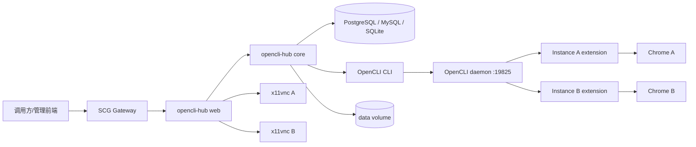
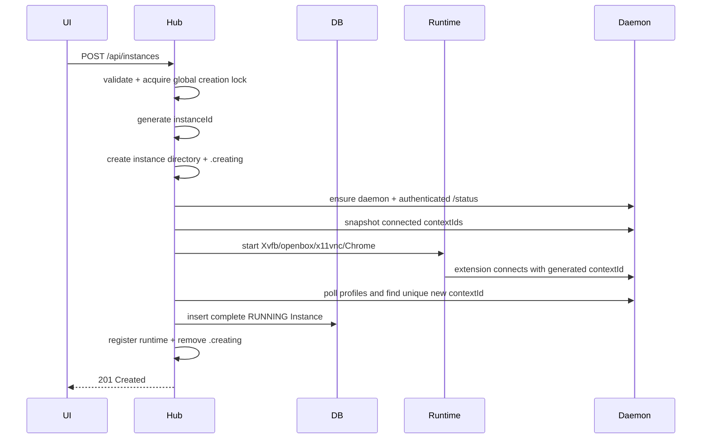
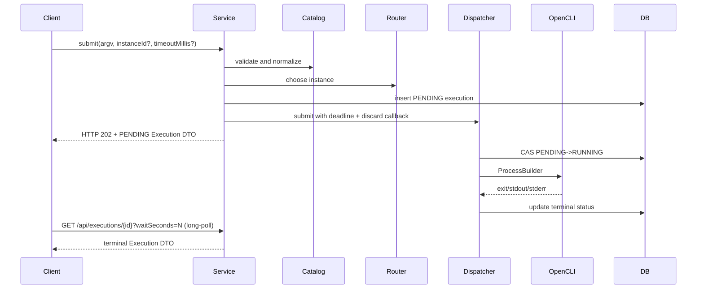

# opencli-hub 技术设计方案

## 1. 文档目的

本文档是 opencli-hub 的最终技术设计基线，描述 release 版本的架构、运行约束与接口契约。

设计目标：

- 使用 Java 17、Spring Boot、MyBatis 构建单机浏览器管理与 OpenCLI 调度平台；生产数据库默认 PostgreSQL 16，另提供 MySQL 8.4 与 SQLite 编译期变体（H2 仅测试）；
- 使用正式 Google Chrome，保持独立、持久的 Chrome Profile；
- 最大程度复用原版 OpenCLI 的命令、Browser Bridge extension、daemon 和 adapter；
- 提供 Instance 管理、VNC、命令执行、资源管理、执行历史、命令配置和日志查看页面；
- 保持 KISS，不引入当前范围不需要的分布式基础设施和抽象。

本文档中的“必须”表示实现约束，“建议”表示默认实现方式。若实现与本文档冲突，应先更新本文档再修改代码。

## 2. 范围

### 2.1 MVP 包含

- Instance 创建、编辑、启动、停止、重启和彻底删除；
- 每个 Instance 独立 Chrome Profile、Xvfb、openbox、x11vnc 和 Chrome 进程；
- 一个容器内共享一个 OpenCLI daemon；
- OpenCLI extension 自动加载与 `contextId` 发现、绑定和恢复；
- 服务启动后顺序拉起数据库中的全部 Instance；
- 基于网站、Instance 状态和队列负载的命令路由；
- 每个 Instance 同时最多执行一个 OpenCLI 命令；
- 异步 OpenCLI Execute API：submit 返回 202 + PENDING，客户端轮询终态，PENDING 可取消；
- Command Catalog 加载、参数校验、命令黑名单和输出资源规则；
- 资源上传、OpenCLI 输出收集、在线预览、下载和管理员手工删除；
- Java WebSocket 到本地 VNC TCP 的代理；
- 系统日志和 Instance 进程日志查看；
- 三套编译期数据库变体（PostgreSQL 16 默认 / MySQL 8.4 LTS / SQLite）都通过 Spring SQL initialization 幂等初始化当前 schema（schema-only，无 data SQL；system settings 由应用懒初始化）；旧 MySQL schema 使用显式迁移；H2 仅用于测试；
- Docker 镜像中安装正式 Google Chrome、OpenCLI CLI 和固定版本 extension。

### 2.2 MVP 不包含

- Redis、MQ、任务消费集群；
- Kubernetes 或 Docker-per-Instance；
- 远程 Agent、跨节点浏览器调度；
- Selenium、ChromeDriver、Playwright 浏览器执行内核；
- 自动验证码处理；
- 自动登录状态探测；
- OpenCLI adapter 重写或 runtime fork；
- 自动命令重试或 write 命令 failover；
- Hub 内的用户、认证、授权、JWT、Session 或角色系统；
- 资源自动过期和定时删除；
- 日志 Elasticsearch、Loki、SSE 或 WebSocket 实时流；
- Instance 软删除、回收站和 Profile 恢复。

## 3. 已确认设计决策

| 议题 | 决策 |
|---|---|
| Java 模块 | `share + core + web`，移除 `infra` |
| 数据库 | 编译期三变体：PostgreSQL 16（默认）、MySQL 8.4 LTS、SQLite；H2 仅测试（Maven `test` scope） |
| SQL | MyBatis Auto Mapper 生成常规 SQL；每个变体通过 Spring SQL initialization 幂等初始化当前 schema（schema-only，无 data SQL，system settings 由应用懒初始化）；旧 MySQL schema 手工迁移 |
| 浏览器 | 正式 `google-chrome-stable`，非 Chromium/Chrome for Testing |
| extension | 由 artifact lock 固定，当前 fork 1.0.29；构建期打包固定签名 CRX3，运行时通过 Linux managed policy + loopback update server 强制安装 |
| OpenCLI | 由 artifact lock 固定，当前 fork 1.8.7-fengwk.8；Hub 通过 `ProcessBuilder` 调用，不在 Hub 内修改 CLI |
| daemon | 单容器共享一个 OpenCLI daemon |
| Instance 创建 | 同步创建，成功后才插入数据库；失败清理全部残留 |
| Instance 创建完成 | Chrome 保持运行，数据库状态为 `RUNNING` |
| 服务启动 | 后台顺序拉起数据库中的全部 Instance；单个失败不影响 Hub 可用 |
| `contextId` | extension 生成，Hub 发现并绑定；严格条件下自动重新绑定 |
| 网站能力 | Instance 记录可编辑的 `websites` 列表，卡片展示 |
| 指定 Instance | 目标网站不在 Instance 的 `websites` 中时严格拒绝 |
| 命令开放 | website browser commands 默认允许，使用黑名单禁用 |
| 参数开放 | 只允许 Command Catalog 声明的业务参数；OpenCLI 控制参数由 Hub 独占 |
| 持久页面 | 遵循 OpenCLI `siteSession`；后续请求用显式 `instanceId` 保持 affinity |
| 执行模式 | 异步 Execute API：submit 返回 HTTP 202 + PENDING DTO，客户端轮询终态，PENDING 可取消 |
| 超时 | API `timeoutMillis` 控制端到端排队和执行 deadline；默认 10 分钟，最大 30 分钟 |
| HTTP 断开 | 已开始的任务继续执行到完成或业务 deadline，不自动重试 |
| 资源 | 每日目录；上传和执行输出用资源组命名区分；管理员手工删除 |
| 输出规则 | 数据库配置，可在 Commands 页面修改；不修改 OpenCLI Catalog |
| VNC | x11vnc 只监听容器内 localhost，经 Hub WebSocket 和 SCG 访问 |
| 认证 | Hub 不做认证，SCG Gateway 负责认证授权 |
| 日志 | 文件日志 + 页面轮询查看，不引入日志基础设施 |
| 删除 Instance | 停止进程并彻底删除 Profile、日志和数据库记录；保留历史 Execution 与资源 |

## 4. 总体架构



### 4.1 控制平面

Java Hub 负责：

- Instance 配置和生命周期；
- 进程管理；
- Command Catalog 和调用校验；
- 路由和单 Instance 串行队列；
- Execution 记录；
- 资源和日志文件；
- REST API、WebSocket VNC 和管理前端。

### 4.2 执行平面

OpenCLI 负责：

- 命令发现和解析；
- adapter/runtime；
- Browser Bridge 页面操作；
- tab lease 和 persistent/ephemeral session；
- 结构化命令输出。

### 4.3 依赖方向

```text
web -> core -> share
```

- `share`：API DTO、枚举、错误码；
- `core`：业务逻辑、持久化实现、进程实现、资源实现；
- `web`：Controller、WebSocket、启动类和静态前端资源。

`core` 是应用核心模块，不追求“纯领域层”。Repository 接口和实现可以位于同一模块，但 Service 不直接依赖 Mapper/DO。

## 5. 仓库结构

```text
opencli-hub/
├── share/
├── core/
├── web/
├── frontend/
├── docs/
│   ├── README.md
│   ├── technical-design.md
│   ├── uuid-id-migration.md
│   ├── execution-index-migration.md
│   └── browser-proxy-settings.md
├── scripts/
├── Dockerfile
├── pom.xml
└── lombok.config
```

### 5.1 share 包结构

```text
share/src/main/java/fun/fengwk/openclihub/share/
├── constant/
│   └── HubErrorCodes.java
└── model/
    ├── command/
    ├── execution/
    ├── instance/
    ├── log/
    └── resource/
```

### 5.2 core 包结构

```text
core/src/main/java/fun/fengwk/openclihub/core/
├── CoreAutoConfiguration.java
├── property/
├── command/
│   ├── catalog/
│   ├── blacklist/
│   ├── output/
│   └── service/
├── execution/
│   ├── executor/
│   ├── repo/
│   ├── runtime/
│   └── service/
├── instance/
│   ├── repo/
│   ├── runtime/
│   └── service/
├── log/
├── opencli/
└── resource/
```

每个持久化域采用类似 kk-studio 的结构：

```text
instance/
├── service/
│   └── model/HubInstance.java
├── repo/
│   ├── HubInstanceRepository.java
│   └── impl/
│       ├── MybatisHubInstanceRepository.java
│       ├── mapper/HubInstanceMapper.java
│       └── model/HubInstanceDO.java
└── runtime/
```

### 5.3 web 包结构

```text
web/src/main/java/fun/fengwk/openclihub/web/
├── WebApplication.java
├── controller/
│   ├── HubCommandController.java
│   ├── HubExecutionController.java
│   ├── HubInstanceController.java
│   ├── HubLogController.java
│   └── HubResourceController.java
└── vnc/
    ├── HubVncWebSocketConfiguration.java
    └── HubVncWebSocketHandler.java
```

## 6. Docker 运行结构

### 6.1 单容器多进程

一个 opencli-hub 容器包含：

```text
tini
└── Java Hub
    ├── OpenCLI daemon
    ├── Instance A
    │   ├── Xvfb
    │   ├── openbox
    │   ├── x11vnc
    │   └── google-chrome-stable
    └── Instance B
        ├── Xvfb
        ├── openbox
        ├── x11vnc
        └── google-chrome-stable
```

Java Hub 是业务进程和子进程管理者；`tini` 作为 PID 1 负责信号转发和僵尸进程回收。

### 6.2 镜像依赖

镜像构建阶段安装：

- Java 17 runtime；
- Node.js 20 或更高版本；
- `google-chrome-stable`；
- Xvfb、openbox、x11vnc、字体、必要 X11 库；
- 指定版本 `@jackwener/opencli`；
- 指定版本 OpenCLI extension release ZIP；
- noVNC 前端依赖通过 `frontend` 构建进入静态资源。

不安装：

- Chromium；
- Chrome for Testing；
- ChromeDriver；
- Selenium；
- Playwright 浏览器。

### 6.3 版本构建参数

```dockerfile
ARG OPENCLI_VERSION
ARG OPENCLI_EXTENSION_VERSION
ARG GOOGLE_CHROME_PACKAGE_URL
```

OpenCLI：

```bash
npm install -g @jackwener/opencli@${OPENCLI_VERSION}
```

Extension 固定解压到：

```text
/opt/opencli/extension
```

所有 Instance 共享 extension 程序目录，但拥有独立 Chrome Profile 和 extension storage。

### 6.4 用户和沙箱

- Chrome 和 Java 使用非 root 用户运行；
- 默认不使用 `--no-sandbox`；
- Docker 运行建议配置足够的 `/dev/shm`，例如 `shm_size: 2gb`；
- 只有 Hub HTTP 端口暴露给容器网络；VNC 和 daemon 端口不暴露。

### 6.5 数据卷

```text
/data/opencli-hub/
├── instances/
├── resources/
└── logs/
```

该目录必须挂载持久 Volume。

## 7. 配置模型

```yaml
spring:
  application:
    name: opencli-hub

opencli:
  hub:
    data-dir: ${OPENCLI_HUB_DATA_DIR:/data/opencli-hub}

    opencli:
      binary: ${OPENCLI_HUB_OPENCLI_BINARY:opencli}
      workdir: ${OPENCLI_HUB_OPENCLI_WORKDIR:/opt/opencli}
      extension-dir: ${OPENCLI_HUB_EXTENSION_DIR:/opt/opencli/extension}

    browser:
      binary: ${OPENCLI_HUB_CHROME_BINARY:/usr/bin/google-chrome-stable}
      screen-width: 1600
      screen-height: 900
      screen-depth: 24
      startup-timeout-millis: 60000

    vnc:
      startup-timeout-millis: 10000

    runtime:
      startup-recovery-enabled: true
      display-base: 99
      vnc-port-base: 5900
      vnc-port-max: 5999
      process-stop-grace-millis: 3000
      readiness-poll-millis: 50

    execution:
      default-timeout-millis: 600000
      max-timeout-millis: 1800000
      process-stop-grace-millis: 3000
      max-capture-chars: 65535
      default-max-pending: 5

    resource:
      root-dir: ${OPENCLI_HUB_RESOURCE_DIR:${opencli.hub.data-dir}/resources}
      max-file-size: 104857600
      max-request-size: 524288000

logging:
  file:
    path: ${OPENCLI_HUB_LOG_PATH:${opencli.hub.data-dir}/logs}
    max-history: 14
    max-size: 128MB
    total-size-cap: 8GB
```

Hub 不配置 SCG、客户端或反向代理 HTTP timeout。

## 8. 数据模型

### 8.1 HubInstance

```java
public class HubInstance {
    private String id;
    private String code;
    private String displayName;
    private String contextId;
    private HubInstanceState state;
    private List<String> websites;
    private int maxPending;
    private HubProxyMode proxyMode;
    private String proxyServer;
    private String lastErrorMessage;
    private LocalDateTime stateChangedAt;
    private LocalDateTime createTime;
    private LocalDateTime updateTime;
}
```

状态：

```java
public enum HubInstanceState {
    STARTING,
    RUNNING,
    STOPPING,
    STOPPED,
    ERROR
}
```

语义：

- `STARTING`：已有 Instance 正在启动或服务恢复中；
- `RUNNING`：Chrome、VNC 和 extension 已就绪；
- `STOPPING`：正在停止进程；
- `STOPPED`：当前运行周期内被管理员停止；容器重启后仍自动启动；
- `ERROR`：启动、运行时检查或重新绑定失败。

`websites` 表示管理员确认该 Instance 可以参与这些网站的路由，不表示 OpenCLI 理论上支持的站点。

### 8.2 HubExecution

```java
public class HubExecution {
    private String id;
    private String instanceId;
    private String instanceCode;
    private String commandKey;
    private String site;
    private SiteSessionMode siteSession;
    private List<String> argv;
    private boolean reuseInstance;
    private HubExecutionStatus status;
    private Integer exitCode;
    private String stdout;
    private String stderr;
    private String errorMessage;
    private long timeoutMillis;
    private LocalDateTime queuedAt;
    private LocalDateTime startedAt;
    private LocalDateTime finishedAt;
}
```

状态：

```java
public enum HubExecutionStatus {
    PENDING,
    RUNNING,
    SUCCEEDED,
    FAILED,
    TIMED_OUT
}
```

不增加取消、重试和部分成功状态。

### 8.3 命令策略

```java
public class HubCommandBlacklist {
    private String id;
    private String commandKey;
    private String reason;
}
```

```java
public class HubCommandOutputRule {
    private String id;
    private String commandKey;
    private String argumentName;
    private HubCommandOutputTargetType targetType;
    private String fileName;
}
```

```java
public enum HubCommandOutputTargetType {
    DIRECTORY,
    FILE
}
```

## 9. 数据库设计

### 9.1 表清单

| 表 | 用途 |
|---|---|
| `hub_instance` | Instance 配置、最近运行状态和 Instance 代理覆盖 |
| `hub_system_settings` | 全局浏览器代理策略单例 |
| `hub_execution` | 异步命令执行历史（202 submit + 轮询终态） |
| `hub_command_blacklist` | 被管理员禁用的命令 |
| `hub_command_output_rule` | OpenCLI 本地资源输出参数规则 |

不建立资源表、日志表、运行时进程表、VNC session 表和 Command Catalog 全量表。

除 `hub_system_settings` 使用固定 `id=1` 单例外，其余四张业务表的新主键均由 JDK `UUID.randomUUID()` 本地生成，数据库与运行时不依赖 Snowflake、`worker-id`、Redis 或其他 ID 服务。迁移前的正 BIGINT ID 原值转换为十进制字符串，不改名 Instance 目录或 execution resource group。`code` 保持唯一但可编辑的业务别名，不承担内部身份。

时间语义：所有时间戳列（`state_changed_at`、`queued_at`、`started_at`、`finished_at`、`gmt_create`、`gmt_modified`）
保存**UTC LocalDateTime**。应用使用统一的 `Clock.systemUTC()` bean 生成时间；PostgreSQL 会话强制
`set time zone 'UTC'`，MySQL JDBC 连接固定 `connectionTimeZone=UTC`，SQLite 的 `CURRENT_TIMESTAMP`
按 UTC 求值。`gmt_*` 列名沿用历史命名以兼容旧客户端，语义仍是 UTC 时间戳。`queued_at` 是 Execution
列表排序键；`state_changed_at` 记录 Instance 状态变更时间（列表排序不使用它）。两者都是不可变时间戳：
由应用显式写入，数据库不得 `ON UPDATE`（MySQL legacy schema 需执行对应迁移脚本去除 `ON UPDATE`）。

### 9.2 hub_instance

```sql
create table hub_instance (
    id varchar(36) not null,
    code varchar(64) not null,
    display_name varchar(128) not null,
    context_id varchar(128) null,
    state varchar(32) not null,
    websites_json text not null,
    max_pending int not null,
    priority int not null default 0,
    proxy_mode varchar(16) not null default 'INHERIT',
    proxy_server varchar(512) null,
    last_error_message text null,
    state_changed_at timestamp(3) not null default current_timestamp(3),
    gmt_create timestamp(3) not null,
    gmt_modified timestamp(3) not null,
    version bigint not null default 0,
    primary key (id),
    unique key uk_hub_instance_code (code),
    unique key uk_hub_instance_context_id (context_id),
    key idx_hub_instance_state (state)
);
```

不持久化：

- VNC endpoint；
- DISPLAY；
- Chrome/Xvfb/x11vnc PID；
- active/pending；
- Chrome Profile 绝对路径；
- OpenCLI profile alias。

Profile 路径由 ID 计算：

```text
{dataDir}/instances/{instanceId}/chrome
```

### 9.3 hub_system_settings

全局浏览器代理策略使用单例行 `id=1`，只影响之后启动的 Instance。**没有 data SQL**：该行由应用在
首次读取时懒初始化（默认 `DIRECT`，`DuplicateKeyException` 保证并发安全），见 `HubSystemSettingsServiceImpl`：

```sql
create table hub_system_settings (
    id int not null,
    proxy_mode varchar(16) not null,
    proxy_server varchar(512) null,
    gmt_create timestamp(3) not null,
    gmt_modified timestamp(3) not null,
    version bigint not null default 0,
    primary key (id)
);
```

全局 `proxy_mode` 只能是 `DIRECT` 或 `CUSTOM`；Instance 的 `INHERIT` 在启动时解析为当前全局策略。代理只用于 Chrome 网站流量，不代理 Hub HTTP、共享 daemon 或 loopback CRX/bridge 流量。代理 URI 必须是带显式端口且不含凭据的 `http`、`https`、`socks4` 或 `socks5` URI。

### 9.4 hub_execution

```sql
create table hub_execution (
    id varchar(36) not null,
    instance_id varchar(36) null,
    instance_code varchar(64) null,
    command_key varchar(160) not null,
    site varchar(80) not null,
    site_session varchar(16) not null,
    argv_json text not null,
    reuse_instance tinyint(1) not null default 0,
    status varchar(32) not null,
    exit_code int null,
    stdout_content mediumtext null,
    stdout_truncated tinyint(1) not null default 0,
    stderr_content mediumtext null,
    stderr_truncated tinyint(1) not null default 0,
    error_message text null,
    timeout_millis bigint not null,
    -- immutable enqueue time; DEFAULT only, no ON UPDATE
    queued_at timestamp(3) not null default current_timestamp(3),
    started_at timestamp(3) null,
    finished_at timestamp(3) null,
    gmt_create timestamp(3) not null,
    gmt_modified timestamp(3) not null,
    version bigint not null default 0,
    primary key (id),
    key idx_hub_execution_queued_at_id (queued_at, id),
    key idx_hub_execution_instance_queued_at_id (instance_id, queued_at, id),
    key idx_hub_execution_status (status)
);
```

不建立到 `hub_instance` 的外键，因为删除 Instance 后必须保留历史 Execution。

Execution 列表固定按 `queued_at DESC, id DESC` 排序；按 Instance 查询先以 `instance_id` 等值过滤。
MySQL 5.7/8.4 的 InnoDB 都可以反向扫描普通升序 B-tree，因此以上两个组合索引分别覆盖全量和按 Instance 的稳定分页查询，不需要 MySQL 8.0 的降序索引语法。
`instance_id` 单列索引已被组合索引左前缀覆盖，不再单独保留；`gmt_create` 不参与该查询排序。

`queued_at` 是不可变入队时间：应用写入，数据库无 `ON UPDATE`（MySQL legacy schema 用
`scripts/migrate-mysql-execution-queued-at-immutable.sql` 修复）。PostgreSQL/SQLite 中 `stdout_content`/
`stderr_content` 使用 `text`（SQLite 无 `mediumtext` 类型）。

### 9.5 hub_command_blacklist

```sql
create table hub_command_blacklist (
    id varchar(36) not null,
    command_key varchar(160) not null,
    reason varchar(512) null,
    gmt_create timestamp(3) not null,
    gmt_modified timestamp(3) not null,
    version bigint not null default 0,
    primary key (id),
    unique key uk_hub_command_blacklist_command_key (command_key)
);
```

### 9.6 hub_command_output_rule

```sql
create table hub_command_output_rule (
    id varchar(36) not null,
    command_key varchar(160) not null,
    argument_name varchar(64) not null,
    target_type varchar(32) not null,
    file_name varchar(255) null,
    gmt_create timestamp(3) not null,
    gmt_modified timestamp(3) not null,
    version bigint not null default 0,
    primary key (id),
    unique key uk_hub_command_output_rule_command_key (command_key)
);
```

### 9.7 SQL 与数据库配置（编译期变体）

```text
core/src/main/database/{postgresql,mysql,sqlite}/schema-database.sql
web/src/main/database/{postgresql,mysql,sqlite}/application-database.yml
```

- 每个变体一份 DDL 与一份 datasource 配置；Maven profile（`postgresql` 默认 / `mysql` / `sqlite`）
  选择变体，`application-database.yml` 在构建期复制到 classpath 根（`spring.config.import`），
  三者都设置 `spring.sql.init.mode=always` 与 `schema-locations: classpath:schema-database.sql`；
- 初始化是 **schema-only**：只幂等建当前 schema，**没有 data SQL**；`hub_system_settings` 单例由应用懒初始化；
- 旧文件名 `schema-mysql.sql` / `data-mysql.sql` / `schema-h2.sql` / `data-h2.sql` 已移除，H2 仅存在于测试资源
  （`core/src/test/resources`），不再有生产 H2 初始化；
- MySQL fresh schema 仍使用 5.7 兼容语法（普通升序 B-tree、`utf8mb4`、`timestamp(3)`），同一文件可在
  5.7 与 8.4 建表；官方 compose 固定 8.4 LTS；
- 既有 MySQL schema 不会被该文件 ALTER；按变更内容在停机备份后依次执行 `scripts/migrate-mysql-uuid-ids.sql`、
  `scripts/migrate-mysql-browser-proxy-settings.sql`、`scripts/migrate-mysql-execution-indexes.sql`、
  `scripts/migrate-mysql-instance-priority.sql`、`scripts/migrate-mysql-execution-queued-at-immutable.sql`、
  `scripts/migrate-mysql-instance-state-changed-at-immutable.sql`（全部兼容 5.7/8.4）；
- 迁移流程见 `docs/uuid-id-migration.md`、`docs/execution-index-migration.md` 和 `docs/deployment-and-operations.md`；
- Service、Repository 和 Mapper 不负责建表；
- 删除当前 `Repository.init()`、`Mapper.createTableIfNotExists()` 链路。

## 10. MyBatis Auto Mapper

### 10.1 CoreAutoConfiguration

```java
@BaseMapperScan
@ComponentScan
@Configuration
@EnableConfigurationProperties(OpenCliHubProperties.class)
public class CoreAutoConfiguration {
}
```

### 10.2 Mapper 方法

```java
@AutoMapper(tableName = "hub_instance")
public interface HubInstanceMapper extends BaseMapper {
    int insert(HubInstanceDO instanceDO);
    int updateById(HubInstanceDO instanceDO);
    int deleteById(String id);
    HubInstanceDO findById(String id);
    HubInstanceDO findByCode(String code);
    HubInstanceDO findByContextId(String contextId);
    List<HubInstanceDO> findAllOrderByCreateTimeAndId();
}
```

```java
@AutoMapper(tableName = "hub_execution")
public interface HubExecutionMapper extends BaseMapper {
    int insert(HubExecutionDO executionDO);
    int updateById(HubExecutionDO executionDO);
    HubExecutionDO findById(String id);
    long countAll();
    @MethodExpr("pageAllOrderByQueuedAtDescAndIdDesc")
    List<HubExecutionDO> pageAllOrderByQueuedAtDescIdDesc(
        @Param("offset") long offset,
        @Param("limit") int limit);
    long countByInstanceId(String instanceId);
    @MethodExpr("pageByInstanceIdOrderByQueuedAtDescAndIdDesc")
    List<HubExecutionDO> pageByInstanceIdOrderByQueuedAtDescIdDesc(
        @Param("instanceId") String instanceId,
        @Param("offset") long offset,
        @Param("limit") int limit);
}
```

AutoMapper `1.0.1` 由 `convention4j-parent:1.2.3` 统一管理。黑名单和输出规则使用同样的命名方式；常规 CRUD 与简单稳定排序直接由方法签名生成，`HubInstanceDO.createTime` 的 `@FieldName("gmt_create")` 同样用于解析 `OrderByCreateTime`。仅当现有 Java 方法名无法直接表达完整规则时使用 `@MethodExpr` 保持方法名兼容。不得在 `src/main/resources` 提交同路径空 Mapper XML；Auto Mapper 注解处理器在 Maven `compile` 阶段直接将完整 XML 生成到 `target/classes`。若源码资源中存在同路径空 XML，会因 `resources` 先于 `compile` 执行而遮蔽生成结果。

### 10.3 Repository 约束

Repository 负责：

- ID 生成；
- Domain 与 DO 转换；
- JSON 序列化；
- 分页组装；
- Mapper 调用。

Repository 不负责：

- 建表；
- 启动浏览器；
- 执行 OpenCLI；
- 文件系统清理。

## 11. OpenCLI Command Catalog

### 11.1 加载

应用启动时执行：

```bash
opencli list -f json
```

解析并加载：

- `site`；
- `name`；
- `aliases`；
- `description`；
- `access`；
- `browser`；
- `args`；
- `siteSession`；
- `defaultWindowMode`。

Catalog 加载失败属于镜像或依赖错误，应用启动失败并输出明确日志。Catalog 不存数据库。

### 11.2 公开命令范围

只公开：

```text
website command && browser == true
```

以下 OpenCLI 管理命令永不进入公开范围：

```text
browser
daemon
plugin
profile
doctor
list
external
completion
```

网站 browser command 默认允许；命中 `hub_command_blacklist` 时拒绝。

### 11.3 Alias

调用方可以使用 Catalog 中的 alias，但 Hub 必须先解析为 canonical `commandKey`，再执行：

- 黑名单校验；
- 输出规则查找；
- website 查找；
- Execution 记录。

## 12. 调用参数安全

### 12.1 请求模型

```json
{
  "instanceId": 1001,
  "argv": ["bilibili", "hot", "--limit", "5"],
  "timeoutMillis": 600000
}
```

- `instanceId` 可选；
- `argv` 必须以网站和命令开头；
- `timeoutMillis` 可选，默认 600000，最大 1800000。

### 12.2 不允许原样透传

Hub 必须：

```text
parse argv
-> resolve Catalog command
-> validate positional/named arguments
-> normalize arguments
-> resolve resource paths
-> inject managed output rule
-> build new ProcessBuilder argument list
```

禁止直接：

```java
command.addAll(request.getArgv());
```

### 12.3 Hub 独占参数

调用方不能传：

```text
--profile
-f / --format
--site-session
--keep-tab
--window
--trace
-v / --verbose
-h / --help
-V / --version
```

业务命令在 Catalog 中声明的参数允许传入，例如 `--limit`、`--message`、`--op` 等；若某参数被当前命令的输出规则接管，则调用方不能覆盖。

### 12.4 本地路径

只允许 Hub 资源虚拟路径：

```text
/resources/{date}/{group}/{relativePath}
```

调用方必须先上传资源，再把上传响应中的 `resourcePath`（上述虚拟路径）作为独立 argv 值传入；Hub 解析、加 lease 并替换为资源根下的真实路径。**独立 argv 值若是本地路径会被拒绝**：

- 绝对路径（包括恰好位于数据卷资源根内的真实路径）、`~` 展开、`file://` URI、Windows drive path；
- 显式 traversal（`.` / `..` / `./x` / `../x` / 含独立 `..` 段的相对路径，如 `a/../../b`）；
- 相对 OpenCLI workdir 实际存在的文件/目录（按配置的 workdir 解析，不按 JVM cwd；包括嵌套形式如 workdir 下确实存在的 `foo/bar`）；
- 通过 traversal 或符号链接逃逸资源根的 `/resources/...` 引用。

以上一律以 `OPENCLI_LOCAL_PATH_NOT_ALLOWED` 拒绝。http/https 等 URL、`data:`/`mailto:` 等 URI 和普通非路径 prompt 不误判，原样透传；仅含斜杠的普通文本（如完整 prompt `请解释 /etc/passwd 的格式`、日期 `2026/08/12`、workdir 下不存在的 `foo/bar`）同样不视为路径。

最终 argv 防御性校验：Hub 替换/注入的每个绝对路径必须位于 canonical resource root 之下；尚未创建的执行输出目标（managed output）检查规范化目标与最近存在的父目录（`toRealPath`），资源树内任意层级的符号链接都会被拒绝。判定全部基于 Path 语义（normalize/toRealPath/NOFOLLOW_LINKS/Path.startsWith），不使用字符串前缀比较。

### 12.5 进程执行

只使用：

```java
new ProcessBuilder(List<String> command)
```

禁止 `bash -c`、`sh -c` 和字符串拼接 Shell 命令。

## 13. 命令黑名单

### 13.1 语义

- 未在黑名单中的公开 browser command 默认允许；
- 黑名单是全局的，不做每 Instance 命令黑名单；
- `access=read/write` 只用于 UI 展示和筛选，不自动禁止 write；
- 新 OpenCLI 命令在升级后默认允许。

### 13.2 API

```text
GET    /api/opencli/commands
PUT    /api/opencli/commands/{site}/{command}/blacklist
DELETE /api/opencli/commands/{site}/{command}/blacklist
```

禁用时可填写 reason。Alias 必须解析后再判断。

## 14. 输出资源规则

### 14.1 规则

规则存数据库并可在 Commands 页面编辑。

```text
commandKey -> argumentName + targetType + optional fileName
```

- `DIRECTORY`：Hub 注入 execution 资源组目录；
- `FILE`：Hub 注入 execution 资源组下的固定 fileName（须匹配 `[A-Za-z0-9._-]+` 且不得为 `.`/`..`）。

### 14.2 校验

保存规则时校验（基于当前 Catalog）：

- command 存在且是公开 browser command；
- argument 是命令声明的任意具名、非 positional、可接收值的参数（无值 boolean flag 拒绝）；
- targetType 合法；
- `FILE` 必须有 fileName；
- `DIRECTORY` 不允许 fileName；
- fileName 必须匹配安全字符 `[A-Za-z0-9._-]+`（因此不含目录分隔符与控制字符），且不得等于 `.` 或 `..`。

### 14.3 执行

假设：

```text
chatgpt/image -> op -> DIRECTORY
```

Hub 创建：

```text
/data/opencli-hub/resources/2026-07-12/execution-9001001/
```

并执行：

```bash
opencli --profile <contextId> chatgpt image \
  --prompt "a cat" \
  --op /data/opencli-hub/resources/2026-07-12/execution-9001001 \
  --format json
```

执行后递归扫描该组目录，忽略符号链接，返回资源 DTO。空目录可以删除。

规则在保存/upsert 时按当前 Catalog 校验（命令必须是公开 browser command，argument 可以是任意具名、
非 positional、可接收值的参数，无值 boolean flag 拒绝）；校验通过后规则以不可变快照原子生效，命令
DTO 返回真实规则 metadata。执行时不重验 catalog 兼容性：Hub 按 commandKey 直接使用已保存规则注入
托管输出参数，调用方传入被托管参数时返回 `OPENCLI_RESOURCE_OUTPUT_ARGUMENT_MANAGED`。stale 规则
（命令升级后 Catalog 变化）不会在执行时被重验或自动提示，管理员需重新保存或删除规则后按新 Catalog 配置。

## 15. OpenCLI daemon 管理

### 15.1 生命周期

每个 Instance 创建/启动前，Hub 先通过认证的 status 请求确认 daemon。只有当前没有其它
已注册的 Instance runtime 时，daemon 不可用才允许执行：

```bash
opencli daemon restart
```

如果已有其它 Instance runtime，Hub 不执行这个全局 restart，而是 fail closed，避免一个
Instance 的单卡启动/重启断开其它浏览器；管理员需要先恢复共享 daemon。允许 restart 的路径
随后轮询 daemon HTTP status 接口，直到返回有效 pid：

```http
GET http://127.0.0.1:19825/status
X-OpenCLI: 1
```

只接受成功解析的 `/status`，不能把任意 loopback 端口的 4xx 响应视为 daemon 已就绪。Hub 停止时不需要依赖每个 CLI 子进程关闭 daemon；容器停止会终止全部进程。

### 15.2 OpenCliDaemonClient

使用 Java `HttpClient` 访问 daemon status，读取：

- daemon pid/version；
- profiles；
- `contextId`；
- extension version；
- pending；
- `lastSeenAt`（epoch millis）。

不通过解析 `opencli daemon status` 的人类文本获取 profile。

### 15.3 Persistent write session lease recovery

Hub 为每个实际启动的 OpenCLI 子进程注入唯一 owner：

```text
OPENCLI_RUN_OWNER=opencli-hub:<instanceId>:<executionId>
```

当 Hub 已完成该子进程及其 descendants 的 cleanup，且原因是执行 deadline、输出 drain deadline
或 caller interruption 时，Hub 才执行 best-effort recovery：

```text
GET /status (X-OpenCLI: 1)
-> require capability session-recover-v1
-> select only ACTIVE lease whose owner exactly equals OPENCLI_RUN_OWNER
-> POST /session-leases/recover with status identity + expectedRunId
   and mode=CANCEL_AND_RESET
```

daemon 是 lease 的唯一真相源；`expectedRunId` 是 CAS fence。Hub 不根据 PID、TTL 或 stderr
推断 ownership，不碰 `RECOVERING` lease，不重启全局 daemon，不自动重试 recovery，也绝不重放
原 write command。缺 capability、status/recovery HTTP 失败或 `OWNER_CHANGED` 都 fail closed：保留原
Execution 的 timeout/failed terminal result。`RESET_FAILED` 保持 daemon lease fenced，等待人工处理或
只重启受影响 Chrome profile。

## 16. Instance 创建

### 16.1 API 语义

```text
POST /api/instances
```

同步等待完整初始化。UI 只显示创建 Loading；成功后卡片出现，失败时展示错误，不保存失败 Instance 记录。

### 16.2 创建流程



### 16.3 Chrome extension 安装与启动参数

正式 Google Chrome stable 不依赖 unpacked extension 的命令行加载。Release 镜像采用构建期签名和 managed policy：

```text
OpenCLI Browser Bridge extension 1.0.29
-> 构建阶段校验固定版本 release asset
-> BuildKit secret 仅在构建阶段提供受保护的 stable signing key
-> 使用 google-chrome-stable --pack-extension 生成 CRX3
-> 从同一签名产物生成 extension identity、update manifest 和 managed policy
-> loopback update server: 127.0.0.1:18181
-> Chrome 通过 Linux managed policy 强制安装
```

签名 key 只能通过 BuildKit secret 挂载到构建步骤，不能提交到仓库、写入镜像层或复制到运行时。CRX、update manifest 和 policy 必须从同一构建产物生成；policy 中的 extension identity 必须由构建步骤填充，文档和运行时参数不得硬编码历史 ID。`ExtensionInstallForcelist`、`ExtensionSettings` 和 `override_update_url=true` 一起使用，确保首次安装与后续更新都走容器内 loopback update server。Instance Runtime 只负责启动独立 Chrome Profile，容器启动层负责在 Chrome 前提供 CRX 文件和 update manifest。

Java Runtime 允许的 Chrome 参数：

```text
--user-data-dir={instanceDir}/chrome
--enable-unsafe-extension-debugging
--no-first-run
--no-default-browser-check
--disable-sync
--disable-popup-blocking
--window-size=1600,900
```

`--enable-unsafe-extension-debugging` 是正式 Browser Bridge 运行参数；它不负责 unpacked extension 加载，也不改变 managed policy 的安装路径。采用 managed policy 后仍需保留该参数以维持正式运行时的 extension 调试接口兼容。

明确禁止重新加入：

```text
--load-extension
--disable-extensions-except
--disable-features=DisableLoadExtensionCommandLineSwitch
--disable-background-networking
--disable-component-update
```

前三项被正式 Chrome 150 拒绝或忽略；后两项会阻断 managed extension 首次安装/更新。

- 由 `DISPLAY=:{displayNumber}` 选择 Xvfb；
- 使用正式 `google-chrome-stable` headed 模式；
- Chrome 由非 root 用户运行，不默认加 `--no-sandbox`；
- 不添加 WebDriver、ChromeDriver、Selenium 或 Playwright 参数；
- Docker 推荐 `--shm-size=2g`；若宿主默认 seccomp 阻断 Chrome sandbox，部署环境必须提供兼容的 seccomp 配置；
- Release 构建资产、policy 与 update server 必须保持同一签名身份，运行时只读取构建产物。

### 16.4 `contextId` 发现

- 创建前记录 daemon 当前 profiles；
- 创建过程全局串行；
- 新 Chrome extension 首次运行生成 `contextId`；
- Hub 轮询 daemon profiles；
- 必须发现唯一新增且未被数据库绑定的 `contextId`；
- 发现 0 个时超时失败；
- 发现多个时返回歧义错误；
- 新 ID 冲突时拒绝。

### 16.5 成功写入

只有信息完整后才插入：

```text
id
code
displayName
contextId
state = RUNNING
websites
maxPending
```

### 16.6 失败清理

任何步骤失败按逆序：

```text
stop Chrome
-> stop x11vnc
-> stop openbox
-> stop Xvfb
-> release display/vnc allocation
-> delete instance directory
-> release creation lock
```

清理方法必须幂等，保留原始异常，清理异常只写日志。

### 16.7 `.creating` 恢复

创建目录：

```text
{instanceDir}/.creating
```

容器异常退出后，启动时扫描：

- 目录名必须是小写规范 UUID，或能解析为正 `long` 的旧数字 ID；
- 合法目录含 `.creating` 且数据库无记录：删除孤儿目录；
- 合法目录含 `.creating` 且数据库有记录：删除 marker，保留 Profile；
- 合法目录无数据库对应 Instance：视为 Hub 删除失败留下的孤儿目录并清理；
- 其他名称（含超出旧 `long` 范围的纯数字）不自动删除，即使存在 `.creating` 也只告警并保留。

## 17. Instance 启动恢复

### 17.1 应用启动

应用启动后，后台单线程顺序启动所有数据库 Instance；`startup-recovery-enabled` 生产默认开启，仅允许测试或显式诊断关闭：

```text
load all instances order by gmt_create asc, id asc
-> 将全部记录更新为 STARTING，避免展示上一次运行留下的 RUNNING 假状态
-> start A
-> start B
-> start C
```

路由必须同时检查数据库状态和内存 runtime；即使状态数据异常，也不能把没有 runtime 的 Instance 选为候选。

不并发启动，避免 CPU/内存峰值和 context 诊断歧义。

### 17.2 失败隔离

- 单个 Instance 失败：清理其运行时，状态 `ERROR`，记录 lastErrorMessage，继续下一个；
- 全部失败：Hub Web/API 仍可用；
- 管理员可查看日志并手工重试。

### 17.3 已有 `contextId`

启动前记录 daemon profiles，并等待数据库中的 expected `contextId` 连接。

若 expected 未连接但出现唯一新 ID，且：

- 启动过程串行；
- 新 ID 未绑定其他 Instance；
- 新 ID 确实在当前 Chrome 启动后出现；

则自动更新数据库绑定并记录警告。

否则：

- 0 个新增：`EXTENSION_CONNECT_TIMEOUT`；
- 多个新增：`CONTEXT_ID_AMBIGUOUS`；
- 已占用：`CONTEXT_ID_CONFLICT`。

### 17.4 统一启动协调与恢复屏障

所有启动路径（API `create` / `start` / `restart`、启动恢复 sweep、孤儿扫描）通过同一个
`HubInstanceStartCoordinator` 协调；`HubInstanceLifecycleService` 是状态/事务编排者，启动相关实现
拆分为三个协作组件：`HubInstanceFiles`（目录、`.creating` 标记与递归删除）、`HubInstanceRuntimeStarter`
（DISPLAY/VNC 分配、Profile bootstrap、4 进程启动与就绪检查、回滚）、`HubInstanceDaemonContextService`
（共享 daemon 就绪、context 等待与 active-tab bind）：

- 一把全局公平启动锁串行化所有启动。daemon restart、context 快照与唯一新 ID 发现因此
  永不重叠，替换了原先分散的全局 create 锁与 daemon ensure 锁；
- `ApplicationRunner` 在返回前同步调用 `beginRecovery()` 声明恢复屏障，再提交恢复任务；
  因此从 API 可见的恢复宣布时刻起，启动请求就被屏障挡住，恢复任务尚未调度时也不例外；
- 恢复 sweep（orphan scan → 状态归一 → 逐实例启动）完成或失败后由 `finally` 调用
  `completeRecovery()` 释放屏障；executor 提交失败与 `destroy()`（destroy-before-start）
  同样释放，屏障不会永久生效；
- API 启动请求的等待（排队等启动锁 + 恢复屏障）统一有界，上限为
  `runtime.start-coordination-timeout-millis`（默认 60000ms，env
  `OPENCLI_HUB_START_COORDINATION_TIMEOUT_MILLIS`）。等待超时返回
  `INSTANCE_START_RECOVERY_IN_PROGRESS`（恢复屏障生效中）或 `INSTANCE_BUSY`（其他 API
  启动持锁）；等待被中断时返回 `INSTANCE_START_FAILED` 并保留中断标志；
- 锁序恒为 coordinator 锁 → 每实例 lifecycle 锁，stop/delete/update 只取每实例锁，
  不会死锁。

## 18. Instance 停止、重启和删除

### 18.1 停止

```text
POST /api/instances/{id}/stop
```

- 拒绝新的执行路由；
- 如果有 active/pending，返回 `INSTANCE_BUSY`；
- 更新 `STOPPING`；
- 逆序停止进程；
- 注销 runtime 和 dispatcher；
- 更新 `STOPPED`。

`STOPPED` 是当前容器运行周期内的状态，容器重启后仍会自动启动。

### 18.2 重启

```text
POST /api/instances/{id}/restart
```

等价于严格的 stop + start，不重建 Profile，不改变网站列表。启动后按已有 `contextId` 或自动重新绑定规则处理。

### 18.3 删除

```text
DELETE /api/instances/{id}
```

要求 active=0 且 pending=0，否则拒绝。

删除是同步阻塞的（与 OpenCLI execute 的异步契约无关）：

```text
block new routing
-> stop processes
-> remove runtime/dispatcher
-> delete DB instance record
-> delete entire instance directory
-> return 200
```

Instance 根目录由 Hub 独占。若数据库删除成功但目录删除失败，接口返回 `INSTANCE_DELETE_FAILED`；应用下次启动时扫描名称为规范 UUID 或正 `long` 旧数字 ID、但数据库中不存在对应记录的孤儿 Instance 目录并删除。根目录、子条目符号链接和不受 Hub 管理的名称不会自动删除，而是告警并保留。

彻底删除：

- Chrome Profile；
- 登录状态；
- context storage；
- Instance 进程日志；
- runtime marker。

保留：

- 历史 Execution；
- 历史 execution resources。

UI 必须显示不可恢复的二次确认。

## 19. Runtime 和进程管理

### 19.1 HubInstanceRuntime

```java
public class HubInstanceRuntime {
    private String instanceId;
    private String instanceCode;
    private int displayNumber;
    private int vncPort;
    private String instanceDir;
    private Map<HubInstanceProcessKind, ProcessHandle> processes;
    private String contextId;
    private long startedAtMillis;
}
```

只保存在内存。

### 19.2 启动顺序

```text
Xvfb
-> wait display ready
-> openbox
-> x11vnc
-> wait VNC port ready
-> Chrome
-> wait daemon extension profile
```

停止顺序相反。

### 19.3 进程日志

```text
instances/{id}/logs/
├── xvfb.log
├── openbox.log
├── x11vnc.log
└── chrome.log
```

每次启动前清空当前进程日志，ProcessBuilder stdout/stderr 直接重定向到对应文件。

### 19.4 端口和 DISPLAY

- DISPLAY 从配置基准值开始扫描 `/tmp/.X{n}-lock` 和 `/tmp/.X11-unix/X{n}`；
- VNC 从有界配置区间扫描 `127.0.0.1` 可用 TCP 端口；
- allocation 返回后立即在进程内预留 DISPLAY/VNC，直到 runtime 注销或启动回滚，关闭“已分配但尚未 bind”的并发窗口；
- x11vnc 必须加 `-listen 127.0.0.1 -localhost -nopw -shared -forever -noxdamage`；
- VNC port 只存 runtime，不持久化。

### 19.5 进程退出

- watcher 轮询 Xvfb、openbox、x11vnc 和 Chrome 的全部已跟踪 `ProcessHandle`；
- 任一进程非预期退出时，先停止其余进程、注销 runtime/dispatcher，再将 Instance 标记 `ERROR`；
- MVP 不自动重启单个进程；管理员可点重启；
- 停止时先快照 descendants 并对父进程 `destroy()`；等待 grace 后，无论父进程是否已退出，都对仍存活的 descendants 和父进程执行 `destroyForcibly()`。

## 20. 路由和队列

### 20.1 候选 Instance

自动路由候选条件：

```text
state == RUNNING
&& runtime exists
&& contextId connected
&& websites contains command.site
&& pending < maxPending
```

### 20.2 选择策略

```text
load = activeCount + pendingCount
```

选择 load 最小者；load 相同时选 `priority` 更大者（默认 0，越大越优先）；仍相同时按不透明字符串 ID 的字典序排序，仅用于稳定打破平局，不表达创建时间。

### 20.3 指定 Instance

请求传 `instanceId` 时严格校验：

- Instance 存在；
- 状态 RUNNING；
- website 已启用；
- context 在线；
- 队列未满。

任何失败直接返回，不 failover。

### 20.4 单 Instance 串行

每个 Instance 使用：

```text
ThreadPoolExecutor(1, 1, ArrayBlockingQueue(maxPending))
```

- active 最大为 1；
- queue 有界；
- 满时返回 429；
- 删除/停止前必须 active=0、pending=0。

## 21. Persistent Session 路由

### 21.1 OpenCLI 行为

- 默认 `siteSession=ephemeral`；
- ephemeral 命令完成后释放 tab lease；
- persistent 使用固定 `site:{site}` session，并保留页面；
- 同一个 Instance、同一个 site 原则上只有一个 persistent page context。

### 21.2 Hub affinity

首次 persistent 请求未指定 `instanceId`：

- 正常自动选择；
- 响应返回实际 `instanceId`；
- `reuseInstance=true`。

后续请求必须显式回传该 `instanceId`。Hub 不维护 `routingKey -> instanceId` 表。

Persistent 指定 Instance 不可用时直接失败，不允许 failover 或重试。

### 21.3 多调用方限制

同一 Instance 的同一网站 persistent tab 可能被多个调用方共享。MVP 约定需要独立上下文的调用方使用独立 Instance；不修改 OpenCLI session key。

## 22. 异步 Execution

### 22.1 流程

执行采用异步 submit/poll 契约：



- `POST /api/opencli/execute` 只做验证、持久化 PENDING 和入队，然后立即返回 **HTTP 202 Accepted**，body 为 PENDING 状态的 Execution DTO（含 `executionId`）；
- 客户端轮询 `GET /api/executions/{id}?waitSeconds=N`（N 最大 120，long-poll 直到终态或超时）获取终态结果；
- 排队期间可调用 `POST /api/executions/{id}/cancel` 取消（仅 PENDING 可取消；RUNNING 返回 `EXECUTION_NOT_CANCELLABLE`）。

所有 Execution 状态迁移（PENDING→RUNNING、PENDING→CANCELLED、PENDING→终态）都通过应用 Service 的 Repository CAS 完成；Dispatcher/Registry 只管理调度句柄和队列。当排队中的任务因 clear queue、强制 shutdown 或取消被丢弃时，dispatcher 通过 discard 回调通知 Service，Service 以 CAS PENDING→CANCELLED 持久化，因此清理后不会残留 DB PENDING 行。

### 22.2 Deadline

`timeoutMillis` 从准备入队时开始计算，包括：

```text
queue wait + process execution
```

- 默认 600000；
- 最大 1800000；
- `<=0` 或超过上限直接拒绝；
- 使用 `System.nanoTime()` 计算剩余时间。

排队超时：不启动 OpenCLI，状态 `TIMED_OUT`。

执行超时：

```text
process.destroy()
-> wait process-stop-grace-millis
-> destroy descendants
-> process.destroyForcibly()
-> capability-gated exact-owner session recovery
-> status TIMED_OUT
```

### 22.3 客户端断开

客户端、Gateway 或网络断开不取消执行。任务继续到完成或 deadline；最终状态写数据库；不自动重试。

### 22.4 OpenCLI 命令

```text
opencli
--profile <contextId>
<normalized argv>
<managed output argument if any>
--format json
```

调用方业务参数中的 `--timeout` 不等同于 Hub `timeoutMillis`；Hub deadline 始终是上限。

### 22.5 输出处理

- exitCode=0 且 stdout 可解析为 JSON：`SUCCEEDED`；
- exitCode!=0：`FAILED`；
- exitCode=0 但 JSON 无法解析：`FAILED`，错误 `OPENCLI_INVALID_JSON_OUTPUT`；
- stdout/stderr 按 `maxCaptureChars` 截断并记录是否截断；
- 资源列表来自 execution resource group 扫描。

### 22.6 HTTP 返回

请求、路由、校验失败使用明确 4xx/429。

`POST /api/opencli/execute` 在 Execution 已持久化 PENDING 并成功入队后返回 **HTTP 202 Accepted**，body 为 PENDING 状态的 Execution DTO（含 `executionId`）；即使后续执行以 `FAILED` 或 `TIMED_OUT` 结束，submit 本身仍是成功的 202。HTTP 客户端注意事项：

- 202 是"已接受"而非"已完成"，客户端必须继续轮询 `GET /api/executions/{id}?waitSeconds=N`（或调用 cancel）获取终态；
- 202 属于 2xx，`curl --fail` 等按成功处理的客户端不会报错；
- Gateway/代理若把 202 当作异常状态拦截，需要放行 202 并保持足够长的响应超时覆盖排队和执行时间。

取消语义：`POST /api/executions/{id}/cancel` 仅对 PENDING 生效（CAS PENDING→CANCELLED），成功后返回 CANCELLED DTO 并同步释放 dispatcher 队列句柄；RUNNING 或已终态返回对应错误或终态 DTO。clear-queue 和强制 shutdown 丢弃的排队任务同样持久化为 CANCELLED，不会残留 DB PENDING。

## 23. 资源中心

### 23.1 文件结构

```text
/data/opencli-hub/resources/
├── 2026-07-12/
│   ├── upload-{uuid}/
│   │   └── file
│   └── execution-{executionId}/
│       └── output files
└── 2026-07-13/
    ├── upload-{uuid}/
    │   └── file
    └── execution-{executionId}/
        └── output files
```

日期使用 UTC。来源只用于展示，上传和执行输出都可以作为后续命令输入。

### 23.2 虚拟路径

```text
/resources/{yyyy-MM-dd}/{group}/{relativePath}
```

示例：

```text
/resources/2026-07-12/upload-uuid/report.pdf
/resources/2026-07-12/execution-9001001/result.png
```

Hub 将虚拟路径解析为 data volume 下的真实路径。

### 23.3 上传

```text
POST /api/resources/uploads
Content-Type: multipart/form-data
```

- 支持单文件和多文件；
- 每个上传请求创建一个 `upload-{uuid}` 组；
- 文件名安全化并防止重复覆盖；
- 校验请求总大小和单文件大小；
- 返回 resourcePath、preview/download URL、MIME、size、createdAt。

### 23.4 浏览

```text
GET /api/resources/dates
GET /api/resources?date=2026-07-12
GET /api/resources/{date}/{group}/{path}
```

文件系统是事实来源，不建立资源表。按日期扫描，支持文件名搜索、来源过滤、大小和时间排序。

### 23.4.1 执行产物托管

当命令声明本地输出参数（`op` / `out` / `output` / `outdir` / 明确为下载目录的 `path` 等）时，Hub 在没有管理员显式输出规则的情况下也会自动托管该参数：创建 `execution-{id}` 资源组并注入绝对路径。这些参数对调用方 API **不可见**，调用方不得也不需要传容器路径。

执行结束后，Hub 仅扫描本次 `execution-{id}` 资源组内文件并返回 `resources[]`。插件必须把最终产物写入平台注入的输出目录。不提供任意绝对路径下载，也不从 stdout 捞取容器路径。

### 23.5 预览与下载

- 图片、视频、音频、PDF 可 inline；
- 其他文件 attachment；
- 正确设置 Content-Type、Content-Length、Content-Disposition；
- 不跟随符号链接。

### 23.6 删除

管理员手工删除：

```text
DELETE /api/resources/{date}/{group}/{path}
DELETE /api/resources/{date}/{group}
DELETE /api/resources/{date}
```

- UI 二次确认；
- 正在被 Execution 使用的资源返回 `RESOURCE_IN_USE`；
- 删除空目录；
- 不做 TTL 和自动清理。

## 24. VNC

### 24.1 x11vnc

每个 Instance：

```text
x11vnc -display :N -rfbport <port> -localhost -nopw -shared -forever -noxdamage
```

VNC TCP 只监听容器内 localhost。

### 24.2 Hub WebSocket

```text
/api/instances/{instanceId}/vnc
```

建立连接时：

- 校验 Instance 存在；
- 校验 RUNNING；
- runtime 存在；
- 连接 `127.0.0.1:{vncPort}`；
- 二进制 WebSocket frame 与 TCP 双向转发；
- 关闭任一侧时关闭另一侧。

Hub 不做认证，SCG 代理 WebSocket 并负责认证授权。

### 24.3 前端 noVNC

Instance 详情页动态加载 `@novnc/novnc`，使用 `binary` subprotocol。支持连接、断开、重连、缩放和剪贴板基本操作。

## 25. 日志

### 25.1 系统日志

复用 convention4j Logback：

```text
{logging.file.path}/opencli-hub-all.log
```

保留时间、大小和总容量由 Logback 配置管理。

### 25.2 Instance 日志

```text
instances/{id}/logs/chrome.log
instances/{id}/logs/xvfb.log
instances/{id}/logs/openbox.log
instances/{id}/logs/x11vnc.log
```

每次启动前清空，删除 Instance 时一起删除。

### 25.3 Execution 日志

stdout/stderr 存数据库，在 Execution 详情页查看，不重复写系统日志全文。

### 25.4 API

```text
GET /api/logs/system?lines=500
GET /api/logs/system/download
GET /api/instances/{id}/logs?source=chrome&lines=500
GET /api/instances/{id}/logs/download?source=chrome
```

- lines 默认 500，最大 5000；
- 使用 RandomAccessFile 从文件尾部读取；
- source 是固定枚举，不接受任意路径；
- 不提供清除系统日志 API。

### 25.5 页面

- 系统/Instance 日志切换；
- Instance 和进程源选择；
- level、关键词过滤；
- 手动刷新；
- 可选 5 秒轮询；
- 下载当前日志。

## 26. REST API

### 26.1 Instance

```text
GET    /api/instances
POST   /api/instances
GET    /api/instances/{id}
PUT    /api/instances/{id}
DELETE /api/instances/{id}
POST   /api/instances/{id}/start
POST   /api/instances/{id}/stop
POST   /api/instances/{id}/restart
POST   /api/instances/{id}/clear-queue
POST   /api/instances/{id}/chatgpt-agent/bind-active-tab
```

`clear-queue` 丢弃该 Instance 排队中的 PENDING 任务并持久化为 CANCELLED；
`bind-active-tab` 将 `site:chatgpt-agent` 固定会话绑定到当前活动标签页。

### 26.2 VNC

```text
GET /api/instances/{id}/vnc/status
WS  /api/instances/{id}/vnc
```

### 26.3 Execute 和 Execution

```text
POST /api/opencli/execute
GET  /api/executions
GET  /api/executions/{id}
POST /api/executions/{id}/cancel
```

### 26.4 Commands

```text
GET    /api/opencli/commands
PUT    /api/opencli/commands/{site}/{command}/blacklist
DELETE /api/opencli/commands/{site}/{command}/blacklist
PUT    /api/opencli/commands/{site}/{command}/output-rule
DELETE /api/opencli/commands/{site}/{command}/output-rule
```

### 26.5 Resources

```text
POST   /api/resources/uploads
GET    /api/resources/dates
GET    /api/resources
GET    /api/resources/{date}/{group}/{path}
DELETE /api/resources/{date}/{group}/{path}
DELETE /api/resources/{date}/{group}
DELETE /api/resources/{date}
```

### 26.6 Logs

```text
GET /api/logs/system
GET /api/logs/system/download
GET /api/instances/{id}/logs
GET /api/instances/{id}/logs/download
```

### 26.7 Browser proxy settings

```text
GET /api/settings
PUT /api/settings
```

全局设置的 `proxyMode` 为 `DIRECT` 或 `CUSTOM`；Instance 创建和更新请求可以通过 `proxyMode`/`proxyServer` 选择 `INHERIT`、`DIRECT` 或 `CUSTOM`。代理配置只在 Instance 启动时解析并传给 Chrome，修改后必须重启或 stop/start 才会生效。

## 27. 错误码

至少包含：

### Instance

```text
INSTANCE_NOT_FOUND
INSTANCE_CODE_CONFLICT
INSTANCE_BUSY
INSTANCE_NOT_RUNNING
INSTANCE_WEBSITE_NOT_ENABLED
INSTANCE_QUEUE_FULL
INSTANCE_CONTEXT_NOT_CONNECTED
INSTANCE_START_FAILED
INSTANCE_STOP_FAILED
INSTANCE_DELETE_FAILED
CONTEXT_ID_AMBIGUOUS
CONTEXT_ID_CONFLICT
EXTENSION_CONNECT_TIMEOUT
```

### Command

```text
OPENCLI_COMMAND_NOT_FOUND
OPENCLI_COMMAND_NOT_PUBLIC
OPENCLI_COMMAND_BLACKLISTED
OPENCLI_ARGUMENT_NOT_ALLOWED
OPENCLI_ARGUMENT_INVALID
OPENCLI_RESERVED_ARGUMENT
OPENCLI_LOCAL_PATH_NOT_ALLOWED
OPENCLI_RESOURCE_OUTPUT_ARGUMENT_MANAGED
OPENCLI_RESOURCE_OUTPUT_RULE_INVALID
```

### Execution

```text
EXECUTION_TIMEOUT_OUT_OF_RANGE
QUEUE_WAIT_TIMEOUT
OPENCLI_EXECUTION_TIMEOUT
OPENCLI_EXECUTION_FAILED
OPENCLI_INVALID_JSON_OUTPUT
EXECUTION_PERSIST_FAILED
```

### Resource

```text
RESOURCE_NOT_FOUND
RESOURCE_PATH_INVALID
RESOURCE_IN_USE
RESOURCE_UPLOAD_TOO_LARGE
RESOURCE_DELETE_FAILED
```

### VNC/Log

```text
INSTANCE_VNC_UNAVAILABLE
INSTANCE_RUNTIME_NOT_FOUND
INSTANCE_LOG_SOURCE_INVALID
LOG_FILE_NOT_FOUND
```

错误信息必须包含问题对象和可执行的修复建议，不返回模糊的 unavailable/failed。

## 28. 前端设计

### 28.1 技术栈

沿用 kk-studio：

- React；
- TypeScript；
- Vite；
- React Router；
- TanStack Query；
- Axios；
- lucide-react；
- noVNC；
- Vitest 和 Testing Library。

### 28.2 目录

```text
frontend/src/
├── app/
├── features/
│   ├── commands/
│   ├── executions/
│   ├── instances/
│   ├── logs/
│   └── resources/
├── platform/shell/
└── shared/
    ├── api/
    └── components/
```

### 28.3 页面

```text
/instances
/instances/:id
/executions
/executions/:id
/commands
/resources
/logs
```

### 28.4 Instances

卡片展示：

- 名称和 code；
- RUNNING/STARTING/STOPPED/ERROR；
- website tags；
- active/pending/maxPending；
- contextId；
- 错误摘要；
- 浏览器、编辑、启停、重启、删除操作。

创建使用同步 Loading，成功后刷新列表，失败显示后端错误。

### 28.5 Executions

列表展示 command、Instance、状态、耗时和时间。详情展示：

- 原始 argv；
- stdout JSON；
- stderr；
- error；
- resources；
- persistent affinity 提示。

### 28.6 Commands

支持：

- 站点、read/write、session、启用状态过滤；
- 参数详情；
- 黑名单启用/解除；
- 输出规则创建、更新、删除。

### 28.7 Resources

按日期和来源展示，图片/视频/PDF 预览，上传、下载、单文件/资源组/整日删除。

### 28.8 Logs

系统日志和 Instance 日志查看，轮询、搜索、过滤和下载。

### 28.9 构建

开发：Vite dev server 代理 `/api` 和 WebSocket 到 Java。

生产：前端先构建为 `frontend/dist`，web Maven package 将其作为 `static/` 资源打入 Spring Boot JAR；生成文件不写回 `src/main/resources/static`。

## 29. 认证和安全边界

Hub 不做认证。部署必须保证：

```text
External -> SCG -> opencli-hub private network
```

Hub 容器不直接映射公网端口；SCG 负责：

- 认证；
- 授权；
- 限流；
- 审计；
- HTTP/WebSocket 路由。

Hub 仍负责：

- 参数安全；
- 命令范围；
- 黑名单；
- Instance website 约束；
- ProcessBuilder 安全；
- 文件路径穿越和符号链接防护；
- 文件大小；
- deadline 和队列。

## 30. 测试策略

### 30.1 core 单元测试

使用 Test Repository 和 Fake Runtime/Executor 覆盖：

- Instance 创建成功/失败清理；
- context 唯一发现、歧义、冲突、自动重绑；
- 启动恢复失败隔离；
- 路由条件和 least-busy；
- website 严格校验；
- persistent affinity；
- 队列满和 deadline；
- 参数 parser 和 reserved args；
- blacklist 和 output rule；
- resource path traversal；
- 删除 busy Instance 拒绝。

### 30.2 Repository 集成测试

使用 H2（测试专用内存库，`core/src/test/resources/schema-h2.sql` + `data-h2.sql`）覆盖 CRUD、分页、
唯一约束、JSON 转换和 Auto Mapper SQL；各数据库变体的正式 DDL（`core/src/main/database/*/schema-database.sql`）
在 CI 的 `postgresql`/`mysql`/`sqlite` 矩阵构建中与真实 driver 一起打包验证。

### 30.3 Process/文件测试

- fake executable 验证 argv、timeout、stdout/stderr、kill；
- 临时目录验证 resource resolver、扫描和删除；
- tail reader 验证大文件末尾读取。

### 30.4 web 测试

- Controller 状态码和错误体；
- multipart 上传；
- resource range/inline 下载；
- WebSocket VNC binary proxy；
- 无认证过滤器。

### 30.5 frontend 测试

- Instance card 和创建 Loading；
- website 编辑；
- Command 黑名单/规则；
- Execution 详情；
- Resource 预览和删除确认；
- Logs 自动刷新；
- noVNC 连接状态。

### 30.6 Docker E2E

必须在 Docker 内验证：

1. 正式 Chrome 能加载固定 extension；
2. 新 Profile 自动生成 contextId；
3. daemon status 可发现；
4. Instance 创建后 VNC 可访问；
5. 容器重启后 Instance 自动拉起；
6. PostgreSQL / MySQL / SQLite 三种变体镜像均可构建运行（CI 按 profile 矩阵构建并校验 JDBC driver 隔离）；
7. 首个命令：

```json
{
  "argv": ["bilibili", "hot", "--limit", "5"],
  "timeoutMillis": 600000
}
```

## 31. 当前代码迁移映射

### 保留并重构

- `HubInstance`、`HubExecution`、DTO、Converter；
- `HubInstanceDispatcher`、`HubDispatchRegistry`；
- `HubExecutionServiceImpl` 的 Execution 状态更新骨架；
- `ProcessBuilderOpenCliExecutor`；
- MyBatis DO、Mapper、Repository；
- `OpenCliHubProperties`；
- `WebApplication`；
- convention4j Logback。

### 移动

- `infra` Java 和资源移动到 `core` 各业务包；
- infra 依赖移动到 `core/pom.xml`；
- `InfraAutoConfiguration` 的 `@BaseMapperScan` 合入 `CoreAutoConfiguration`。

### 删除

- `infra` Maven module；
- Repository `init()`；
- Mapper `createTableIfNotExists()`；
- Mapper XML 中常规 CRUD 和 DDL；
- `opencliProfile`、持久化 `vncEndpoint`、`supportedCommands` 旧语义。

### 新增

- Instance runtime/process/context 管理；
- Command Catalog、validator、blacklist、output rule；
- resource center；
- VNC WebSocket；
- logs；
- Controllers；
- frontend；
- Dockerfile；
- SQL 和真实测试。

## 32. 参考组件

- convention4j：Result、Page、BaseMapperScan、ConventionDO 和 Logback 等基础能力；
- kk-studio：业务逻辑、Repository、Mapper/DO 和 React/Vite feature-first 结构的实现参考；
- OpenCLI：官方 CLI、Browser Bridge extension、daemon、profile 和 execution 能力；
- Web2API：Xvfb/openbox/x11vnc、VNC WebSocket 代理、noVNC 和日志页面的实现参考。

## 33. Release 基线

Release 版本应保持以下边界：

- 仓库只保留 `share/core/web` 三个 Maven module；
- Maven test suite、frontend build/test 和 Docker 镜像构建可重复执行；
- 三种编译期数据库变体（PostgreSQL 16 默认 / MySQL 8.4 LTS / SQLite）均通过 Spring SQL initialization 自动应用当前 schema（schema-only；H2 仅测试）；既有 MySQL schema 使用版本化手工迁移（兼容 5.7/8.4）；
- 正式 Chrome 通过 managed policy 加载构建期签名的 extension，并能发现和绑定 `contextId`；
- Instance 支持创建、重启恢复、VNC 登录、编辑 websites 和彻底删除；
- Execute API 安全校验 argv，完成路由、排队、超时、持久 affinity 和资源处理；
- Commands、Resources、Logs 和 Executions 页面可用；
- 无认证逻辑、Redis、MQ、Kubernetes、远程 Agent 或 OpenCLI fork。
